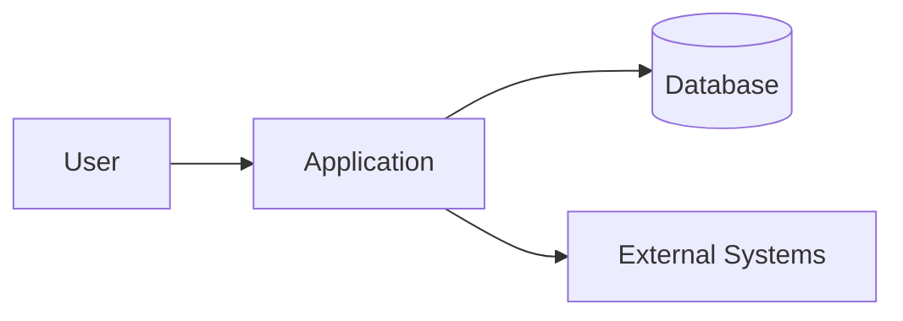

# Architecture - <프로젝트명>

## Overview

TODO: 시스템 경계, 주요 모듈, 외부 연동을 요약한다.

## Data Flow

```mermaid
flowchart LR
    User[User] --> App[Application]
    App --> DB[(Database)]
    App --> External[External Systems]
```

## Constraints

- TODO

## Source Documents

- `docs/raw-specs/yy-mm-dd-[purpose]-raw-file.{ext}`
